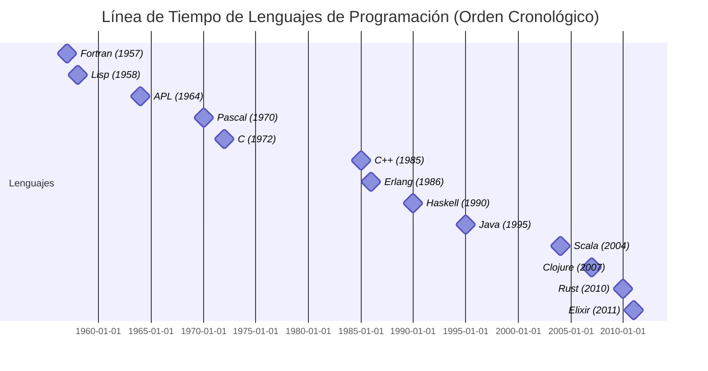

```mermaid

gantt
    dateFormat  YYYY
    title Línea de Tiempo de Lenguajes de Programación (Orden Cronológico)
    
    section Lenguajes
    Fortran (1957)      : milestone, m1, 1957, 0d
    Lisp (1958)         : milestone, m2, 1958, 0d
    APL (1964)          : milestone, m3, 1964, 0d
    Pascal (1970)       : milestone, m4, 1970, 0d
    C (1972)            : milestone, m5, 1972, 0d
    C++ (1985)          : milestone, m6, 1985, 0d
    Erlang (1986)       : milestone, m7, 1986, 0d
    Haskell (1990)      : milestone, m8, 1990, 0d
    Java (1995)         : milestone, m9, 1995, 0d
    Scala (2004)        : milestone, m10, 2004, 0d
    Clojure (2007)      : milestone, m10, 2007, 0d
    Rust (2010)         : milestone, m11, 2010, 0d
    Elixir (2011)       : milestone, m12, 2011, 0d
```