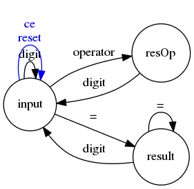

# Simple Calculator...  my fst elm program

[Running example](http://jleahred.github.io/apps/calculator/calculator.html)


This is my very first elm program

It's a very simple calculator simulating the old and toys ones. Only basic
operations.

I never liked the behavior of these calculators, but I understand why they work
this way.
The user can press any key at any moment. The machine, try to give the best
logical action in all cases.

We could do it much better in a software program (disabling buttons, considering
operator priorities, working with expressions...), but the aim, is to simulate
this little, old and popular gadgets.

The language used here is... [elm](http://elm-lang.org/).

It's a pure functional an reactive (functional reactive, of course) language
that compiles to javascript.

We can be introducing a number, showing the result, and even showing a result
when introducing operator preparing next operation.

## FSM



It's not a complete diagram, but we can see the main actors on it.

We will need three status to model the machine.

Lets do it at elm style...

## MODEL the problem

```elm
type Model
    = ModelInput                Input
    | ModelResultInOperation    CurrentOperation
    | ModelResult               Result
```

Really cool. ADT, the right way to model information. Very clear, very direct.

On *ModelInput* whe need to deal with some data, therefore...

```elm
type alias Input =
    { text:             String
    , value:            Float
    , dot:              Bool
    , digits:           Int
    , pow10Dec:         Float
    , currentOperation: CurrentOperation
    }
```

On *CurrentOperation*, we also need to deal with...

```elm
type alias CurrentOperation  =
    (Float, Operator) -- result or first operand and Operator
```

Too easy, a tuple with the first operand and the current operator.

And finishing with the **model**...

```elm
type alias Result =
    { value:         Float
    , lastOperation: LastOperation
    }
```

When in result, we want to keep the result value and last operation.

Las operation is a tuple with operator an operand.

We want it in order to repeat last operation.

We are not reusing *CurrentOperation*, because this is a different context with
different information (using an int for Kg, meters, and seconds is not a great
idea, and is not safe static typing).


> Let the data guide you
>
> -- <cite>adt and functional reactive</cite>


## UPDATE with actions

The user could press a digit button, or an operator, or clear, or...

```elm
type Action
    = PressDigit    Digit
    | Operation     Operator
    | Equal
    | Dot
    | Clear
    | Reset
```

**ADT** again. Very clear, very concise. Just what, no how.

*PressDigit* and *Operation* has a parameter to indicate the digit or the operator pressed.

Lets see them...

```elm
type Digit = D0 | D1 | D2 | D3 | D4 | D5 | D6 | D7 | D8 | D9

type Operator
    = Sum
    | Subs
    | Mult
    | Div
```

Note: As *Operator* is used in *Model*, it is defined there.

*Digit* could be an *Int*, yes. But again... not a very good idea.

Has any sense to add two digits?

Has any sense to add a digit to an abstract number?

Has any sense to have digit 42 and other thousands of them?

No, no and million of times no, therefor *Digit* is a generalization of
concrete digits.

Now, lets do something with actions...

```elm
update : Action -> Model -> Model
```

Our update function, will receive an action and a model, and it will return a new model.

You know, currying...

Let's write the function body

```elm
update keyEvent model =
    case keyEvent of
        PressDigit d    -> addDigit     model d
        Dot             -> addDot       model
        Clear           -> clear        model
        Reset           -> ModelInput   initInput
        Operation  op   -> addOperator  model op
        Equal           -> calculate    model
```

## VIEW the application


```elm
calculatorView _ model =
    flow down
    [ getDisplay model
    , flow right [ btAct "Reset" Reset, btAct "Clear" Clear]
    , flow right [ btDigit D7, btDigit D8, btDigit D9, btAct "+" <| Operation Sum]
    , flow right [ btDigit D4, btDigit D5, btDigit D6, btAct "-" <| Operation Subs]
    , flow right [ btDigit D1, btDigit D2, btDigit D3, btAct "x" <| Operation Mult]
    , flow right [ btDigit D0
                 , btAct "." Dot
                 , btAct "=" Equal
                 , btAct "/" <| Operation Div ]
    ]
```

Display and buttons...

We've created *btDigit* and *btAct* functions to generalize the button creation.

They are not very complex or huge functions...

```elm
btDigit: Digit -> Element
btDigit d =
    btAct (digitToString d) (PressDigit d)

btAct: String -> Action -> Element
btAct txt action =
    button (Signal.message keysMailBox.address action) txt
```

## RUN

```elm
main : Signal Element
main =
    map (calculatorView  keysMailBox.signal) model
```

Apply a curryfied function to show the application to an infinite list... model?

Yes, model is an infinite list...

```elm
model : Signal Model
model =
    foldp update (ModelInput initInput) keysMailBox.signal
```

More information about elm architecture...


## Conclusions

Amazing experience

Full code here, running application here

Functional programming is great.
Functional reactive programing is great
ML, Haskell syntax is great.
Static typing with ADT is great.

Easier to develop, easier to read, easier to maintain

No consistency problems, clear design

Just adding next line on view, you will have all the information to show and follow the logic

```elm
, show model
]
```
