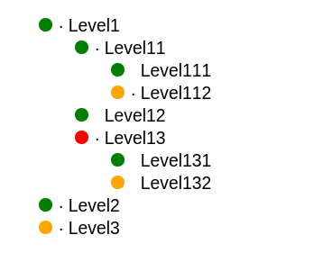

# Status Tree (html)

Running example [here](http://jleahred.github.io/apps/status_tree/index.html)

This is a small html application to show and **update** a status tree.

It will request a json file  *status.json* with the tree information and it will
render...



Json file example...

```json
    [
        {
            "text" : "Level1",
            "status" : "OK",
            "id" : "id1",
            "childs" :
            [
                {
                    "text" : "Level11",
                    "status" : "OK",
                    "id" : "id11",
                    "childs" :
                    [
                        {
                            "text" : "Level111",
                            "status" : "OK",
                            "id" : "id111",
                            "childs" : []
                        }
                    ]
                }
            ]
        }
    ]
```


## Let's show

Running example [here](http://jleahred.github.io/apps/status_tree/index.html)


Needed files...

    * status_tree.html (program)
    * status.json (data)
    * http_server.py (optional)


You can test it with the great tool *elm-reactor*.

You can also run next server...

    python http_server.py


In both cases... point your browser to http://127.0.0.1:8000/status_tree.Html

You can modify the json file, and the view on browser will be updated.

To test, updates will be every 2 seconds.


## TODO

* Expand ERRORs
* Add version and description on json
* Add description on each node
