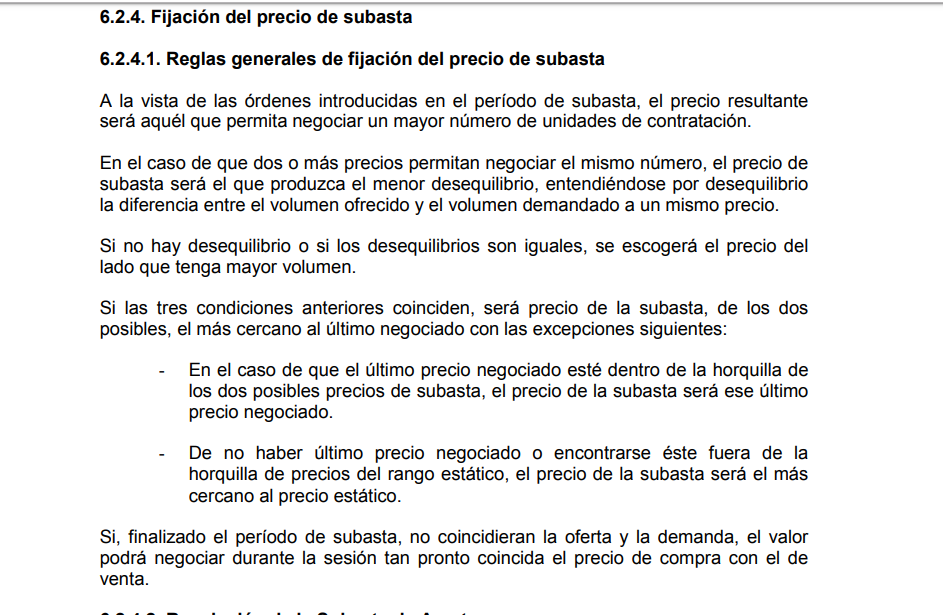

# Auction price calculation

Small and simple program for the calculation of the auction price for a set of orders.

The objective is that the insertion is fast and the calculation of the price as well.

The insertion has an O(log n) cost that could be lowered to O(1) with a hashmap.

The calculation has an O(n) cost

The algorithm calculates the accumulated intra-price volumes on each order insertion.

Then searches for the prices that cross the most volume.
The algorithm then searches for the one that has the least difference between buying and selling, and ends up choosing the one that is closest to the reference price.

Rules...

