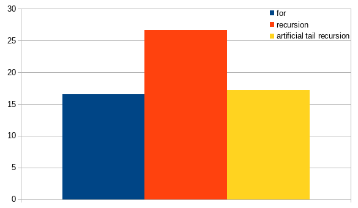
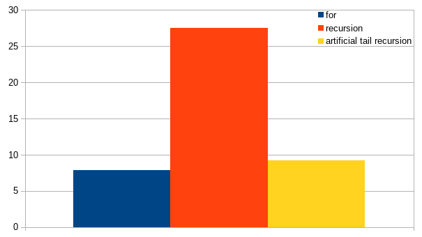
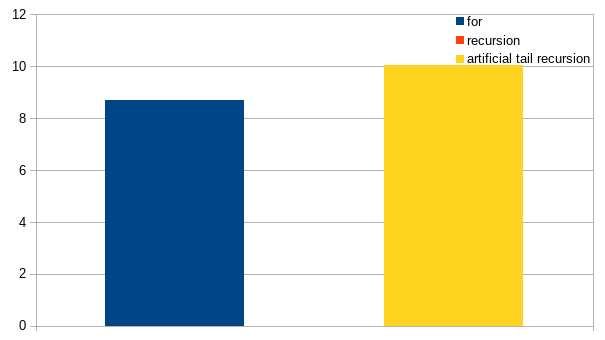

# Rust mutability and recursion

Como ya he comentado en alguna ocasión, la mutabilidad no es vírica en Rust y se puede diseñar un sistema que evite la copia de forma explícita combinándola con el _ownership_.

A continuación un ejemplo de una función que recibe la propiedad de _status_ y lo
declara como mutable. Recuerda, no es vírico. Puesto que se obtiene la propiedad, la declaración de variable en el invocante puede ser inmutable (muy recomendable)

Luego utilzamos un bucle _for_

```Rust
pub(crate) fn parse_literal<'a>(mut status: Status<'a>, literal: &'a Literal<'a>) -> Result<'a> {
    for byte in literal.0.bytes() {
        status = parse_byte(status, byte)
            .map_err(|st| Error::from_status(&st, &format!("parsing literal {}", literal.0)))?;
    }
    Ok((status, literal.0.to_string()))
}
```

No es una mala solución.

Quizá debería haber quitado los _lifetimes_ para dejar el ejemplo más sencillo. No es relevante para lo que estoy planteando aquí. Tampoco molesta ni es malo familiarizarse con ello.

La mutabilidad es muy limitada (muy pocas líneas), no es vírica, el código es conciso,
gestión de errores simplificado...

Para un amante de la programación funcional, es inevitable tensar la cuerda
tratando de quitar la mutabilidad.

El primer intento lógico es, utilizando la recursión:

```Rust
pub(crate) fn parse_literal<'a>(status: Status<'a>, literal: &'a Literal<'a>) -> Result<'a> {
    fn parse_au8<'a>(status: Status<'a>, au8: &[u8], literal: &'a Literal<'a>) -> Result<'a> {
        if au8.len() == 0 {
            Ok((status, literal.0.to_string()))
        } else {
            parse_au8(
                parse_byte(status, au8[0]).map_err(|st| {
                    Error::from_status(&st, &format!("parsing literal {}", &literal.0))
                })?,
                &au8[1..],
                literal,
            )
        }
    }

    parse_au8(status, literal.0.as_bytes(), literal)
}
```

Hemos quitado la mutabilidad. La recursión es de cola, pero no está garantizada su eliminación por el compilador ni LLVM (lo normal es que no se elimine esta recursión) :-(

No obstante, la sobrecarga de la recursión, incluso sin optimización de cola, no es excesiva. Gracias al _ownership_ status no se copia, y los otros dos parámetros son referencias de estructuras sencillas. Uno de ellos es siempre la misma estructura, y el otro, sí se crea en la pila en cada contexto de llamada.

En Rust no tenemos optimización por recursión de cola, pero es posible escribir un poco de código (20 líneas), para tener algo que parece una recursión de cola y hace cuack, pero que es un bucle for.

Esta es la solución que utiliza una _recursión de cola optimizada (artificial)_. Parece recursión, pero el código es traducido a un bucle for.

0% mutabilidad declarada

```Rust
pub(crate) fn parse_literal<'a>(status: Status<'a>, literal: &'a Literal<'a>) -> Result<'a> {
    let init_tc = (literal.0[0..].as_bytes(), Ok(status));

    let result_status =
        tail_call(init_tc, |(pend_lit, acc)| {
            if pend_lit.len() == 0 {
                Ok(TailCall::Return(acc?))
            } else {
                Ok(TailCall::Call((
                    &pend_lit[1..],
                    parse_byte(acc?, pend_lit[0]),
                )))
            }
        }).map_err(|st| Error::from_status(&st, &format!("parsing literal {}", literal.0)))?;

    Ok((result_status, literal.0.to_string()))
}
```

## Show me the data

Y como siempre, las palabras están bien, pero muéstrame las cifras...

Los datos siguientes son comparativos entre las diferentes soluciones, no entre las diferentes configuraciones (no sólo cambia al tamaño, también cambia el número de iteraciones)

En las gráficas se indica el tiempo invertido, lógicamente menos es mejor.

En todos los ejemplos, no se utiliza dinámicamente la memoria del montículo. Esta memoria es igual en todos ellos. No así la de pila, como se verá...

### Literal a procesar pequeño (5 caracteres)



Múltiples ejecuciones. Error inferior al 1%

La ejecución con recursión es un 60% más lenta.

La ejecución con _recursión de cola artificial_ es sólo un 4% más lenta.

### Literal a procesar medio (1_000 caracteres)



Error inferior al 1.5%

La recursión directa está entre 3 y 4 veces más lenta.

La recursión con optimización de cola artificial, 1.17 veces más lenta.

### Literal a procesar grande (1_000_000 caracteres)

La solución con recursión desborda la pila :-(



Error inferior al 0.2%

La recursión con optimización de cola artificial, 1.15 veces más lenta.

### Explicación

Si miramos el código [(aquí)](https://github.com/jleahred/katas/tree/master/langs/rust/mutability_recursion)
de la recursión de cola optimizada artificialmente, vemos que se aplica un bucle for (bien), y en cada iteración se hace una llamada a una lambda.

Si esta lambda no se expande _inline_, se producirá un coste adicional de tiempo, que es lo que vemos en las gráficas. No obstante, la optimización artificial consume menos CPU, pero lo más importante y seguro, es que elimina el desbordamiento de pila.

Para tratar de obtener el mismo rendimiento que el bucle for, deberíamos probar con macros.

## Conclusión

En Rust no podemos contar con la optimización por recursión de cola.

Se puede utilizar el ownership para evitar la infección vírica de la mutabilidad. Esta mutabilidad, puede quedar restringida a un ámbito muy pequeño y no tendrá un efecto negativo en el diseño del código, mientras se maximiza el rendimiento (incluso en ocasiones el código puede ser más legible)

Cuando el código sea más sencillo y elegante con recursión, se puede utilizar una _recursión de cola con optimización artifical_ penalizando en rendimiento por la llamada a la función (no siempre muy relevante) de una forma no determinista (dependiendo de las optimizaciones del compilador), y muy importante, se evitará el desbordamiento de la pila para niveles muy profundos.

Y como siempre, como en todos los microbenchmark... no son fiables ni realistas, los datos no valen de mucho :\_(

> Al menos existe una oveja que tiene uno de los lados negro

Tan sólo podemos confirmar que realmente se puede utilizar recursión de cola sin desbordar la pila  ;-P

Código completo:
[(aquí)](https://github.com/jleahred/katas/tree/master/langs/rust/mutability_recursion)
