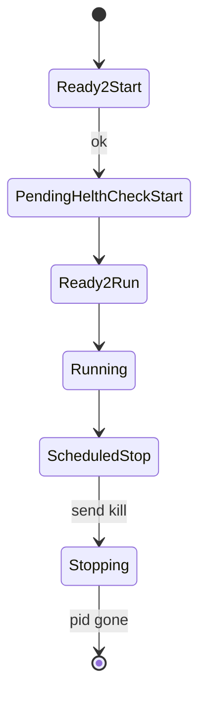

# PROCRUST


## TODO

* commands
* check config
    * depends exists
    * circular references
* command stop
* StartHealthCheck, it too many retrys, reset the service
* command parameters
    * debug
    * ...
* add type oneshot/fake
* tui
* groups
* detect zombie processes
* run-once
* startup parameters
    * allow specifying a configuration file, logs, tui...
* execution retries
    * specify frequency and possibly the number of attempts

## Description

The goal is to create a simple and secure tool to schedule and manage the startup of multiple services/processes on a machine.

It will work with a text file (currently a TOML configuration) for management.

It is declarative; the system will adjust the service configuration to match the document.

Although it may seem like a supervisor, it has some of the characteristics but intentionally lacks others.

It is not intended to replace mature and high-quality tools like systemd, supervisord, Kubernetes...

It must be a small, lightweight, and non-critical program.

It is not designed to start many services very quickly or work with a cluster.

It will not attempt to start many services simultaneously in parallel, as this could cause bottlenecks in already running services.

If this program stops (due to an error, failure, or intentionally), it should not stop all "managed" services.

Once restarted, it should continue monitoring and managing.

## Examples of service configurations

The configuration will start with an identifier for the services to be managed and the configuration file format.

```toml
uid = "550e8400-e29b-41d4-a716-446655440000"
file_format = "0"
```

The identifier can be generated by passing `uid` as a parameter to the program.

### Example of a process configuration 1

```toml
[[process]]
[[process]]
id = "example_process"
command = "echo 'Hello, World!' && sleep 10"
apply_on = "2024-10-01T12:00:00"
type = "normal"                              # optional  normal/fake

[process.schedule]
start_time = "00:00:00"                  # optional
stop_time = "23:59:00"                   # optional
week_days = ["mon", "wed", "thu", "sun"] # optional
# week_days = "mon-fri"   # also valid
# week_days = "all"   # also valid

[process.start_health_check] # optional
command = "curl -I http://localhost:8080"
timeout = { secs = 30, nanos = 0 }        # optional
```

### Example of a process configuration 1

```toml
[[process]]
id = "example_process 2"
command = "echo 'Starting process...'"
apply_on = "2024-10-01T12:00:00"
start_health_check = { command = "curl -I http://localhost:8080", timeout = { secs = 30, nanos = 0 } }
schedule = { start_time = "08:00:00", stop_time = "18:00:00", week_days = [
    "mon",
    "tue",
    "wed",
    "thu",
    "fri",
] }
type = "normal"
depends_on = ["another_process"]
```


If only the command line is changed, the system will not restart the service (this is intentional).

It is not good practice to change only the command line, and restarting the service is a delicate operation.


### Schedule a future new version

Suppose we want to apply a change to service A for startup tomorrow

```toml
# current version running
[[process]]
id = "SERVICE_A"
command = "echo $(date)  '  bb'"
apply_on = "2023-10-01T08:00:00"

# next version to run
[[process]]
id = "SERVICE_A"
command = "echo $(date)  '  bb'; sleep 1; echo $(date)  '  bb'; sleep 1; echo $(date)  '  bb'; sleep 1"
apply_on = "2025-04-01T08:00:00"
```

We see that the service is defined twice.

One configuration started applying in October 2023.

The next configuration will apply on April 1, 2025, at 8:00 AM.

Since it has no start and stop time, it is a 24x7 service.

On April 1, 2025, at 8:00 AM, the first configuration will stop, and once the stop is confirmed, the second option for `SERVICE_A` will execute.

### Rollback

To perform a rollback, we can mark the new version as `fake`

```toml
# current version running
[[process]]
id = "SERVICE_A"
command = "echo $(date)  '  bb'"
apply_on = "2023-10-01T08:00:00"

# next version to run
[[process]]
type = "fake"
id = "SERVICE_A"
command = "echo $(date)  '  bb'; sleep 1; echo $(date)  '  bb'; sleep 1; echo $(date)  '  bb'; sleep 1"
apply_on = "2025-04-01T08:00:00"
```

### Dependencies

The process `DEPENDS_ON_A` will not run until the process `TEST_A` is in the running state.

```toml
[[process]]
id = "TEST_A"
command = "while true; do echo $(date)  '  test a'; sleep 1; done"
apply_on = "2029-11-01T12:20:00"

[[process]]
id = "DEPENDS_ON_A"
command = "while true; do echo $(date)  '  depends on a'; sleep 1; done"
apply_on = "2024-10-01T12:20:00"
depends_on = ["TEST_A"]
```


## Watched ProcessStatus




## Check start health


If you configure start_health_check for a command, the system will not mark the process as running until the command completes successfully.
```toml
[process.start_health_check] 
command = "curl -I http://localhost:8080"
timeout = { secs = 2, nanos = 0 }        # optional
```

