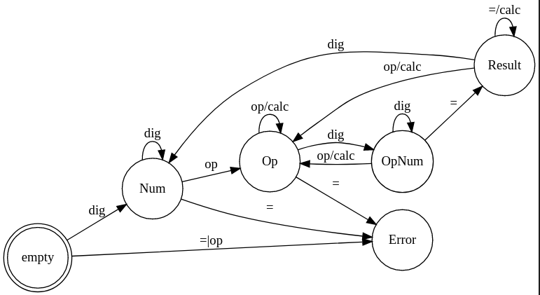
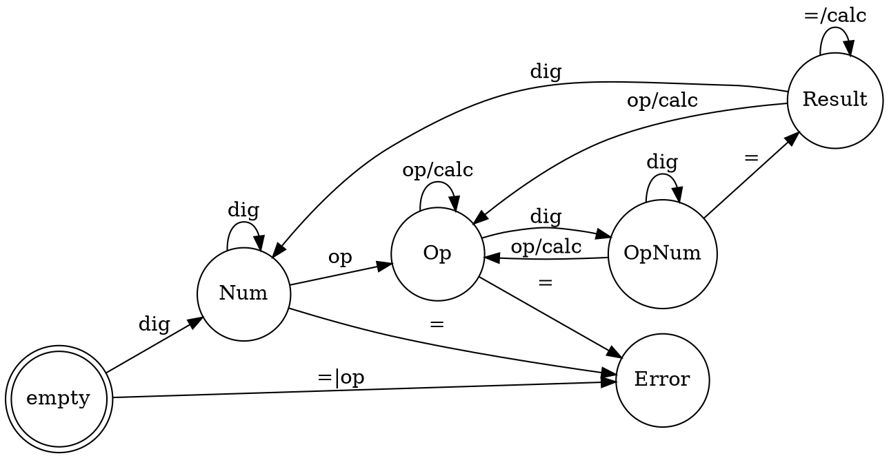

# Simple web calculator in Rust

## Status diagram

## diagrams

```graphviz
digraph finite_state_machine {
    rankdir=LR;
    #size="10"

    node [width=0.9];
    node [shape = doublecircle]; empty;
    node [shape = circle];

    empty -> Num [ label = "dig"]
    empty -> Error [ label = "=|op"]

    Num -> Num [ label = "dig"]
    Num -> Op [ label = "op"]
    Num -> Error [ label = "="]

    Op -> OpNum [ label = "dig"]
    Op -> Op [ label = "op/calc"]
    Op -> Error [ label = "="]

    OpNum -> OpNum [ label = "dig"]
    OpNum -> Op [ label = "op/calc"]
    OpNum -> Result [ label = "="]

    Result -> Num [ label = "dig"]
    Result -> Op [ label = "op/calc"]
    Result -> Result [ label = "=/calc"]
}
```
