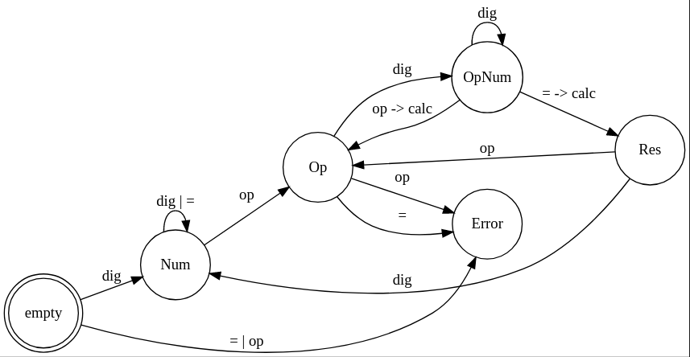
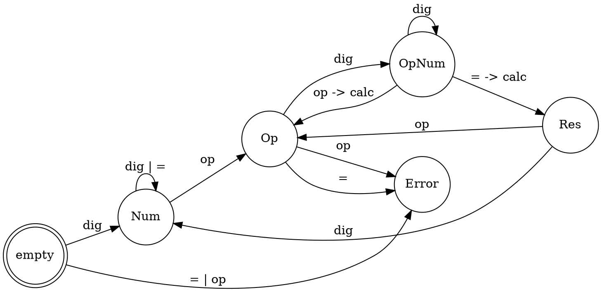

# Simple web calculator in Rust

## Status diagram

[link](http://jleahred.github.io/apps/calculator_rust_md/index.html)

## diagrams

```graphviz
digraph finite_state_machine {
    rankdir=LR;
    #size="10"

    node [width=0.9];
    node [shape = doublecircle]; empty;
    node [shape = circle];

    empty -> Num [ label = "dig"]
    empty -> Error [ label = "= | op"]

    Num -> Num [ label = "dig | ="]
    Num -> Op [ label = "op"]

    Op -> OpNum [ label = "dig"]
    Op -> Error [ label = "op"]
    Op -> Error [ label = "="]

    OpNum -> OpNum [ label = "dig"]
    OpNum -> Op [ label = "op -> calc"]
    OpNum -> Res [ label = "= -> calc"]

    Res -> Op [ label = "op"]
    Res -> Num [ label = "dig"]
}
```
